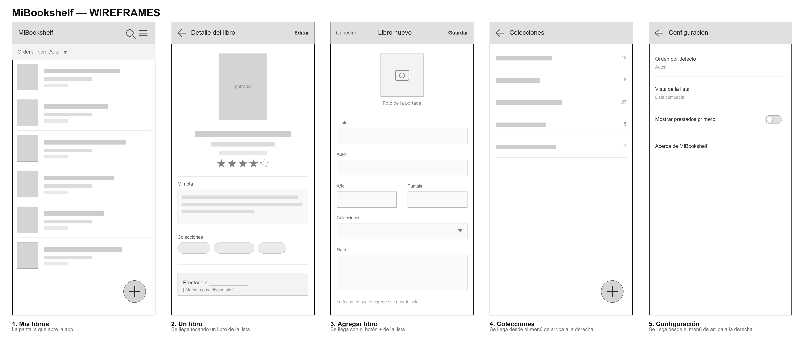
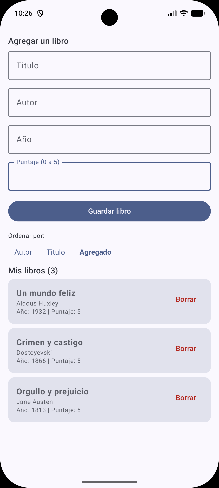

# Mi Bookshelf

App Android nativa y privada para catalogar mis libros físicos. Proyecto final de COM 437 - Desarrollo de Aplicaciones Móviles (Saint Leo University).

> Este README es el documento vivo del proyecto. Arrancó como el borrador del módulo 1 y lo voy actualizando módulo a módulo, con lo que aprendo y con las decisiones que voy cerrando. Lo que cambió en cada actualización está en [CHANGELOG.md](CHANGELOG.md).
>
> **Última actualización: módulo 5** (almacenamiento de datos).

---

## 1. Descripción del proyecto

Para el proyecto final quiero armar una app personal para organizar mi biblioteca de libros físicos. La idea surgió después de probar varias apps de este tipo que ya existen (Libib, LibraryThing, Bookshelf, Fable, Margins, Mibrary) buscando algo simple que me sirviera para lo que necesito, sin encontrar ninguna que cumpliera del todo.

La idea de mi app es simple: cargar mis libros, organizarlos en colecciones propias, dejarles una nota o comentario, y verlos ordenados como yo prefiera en cada momento. Nada de redes sociales ni de compartir con nadie, es un catálogo privado, solo para mí.

## 2. Exposición del problema

Probé varias apps de seguimiento de lectura buscando algo que me sirviera para catalogar mi biblioteca. El problema fue parecido en casi todas: o tienen anuncios, o dejan las funciones que más me interesan atrás de una suscripción paga, o empujan una parte social (agregar amigos, compartir lo que estoy leyendo, clubes de lectura) que no busco para nada.

Pero lo que más me molestó es algo más chico: ninguna me dejaba, en su versión gratuita, ordenar mi lista de libros por distintos criterios (autor, título, año, fecha en que lo agregué, puntaje) sin tener que ir tageando todo a mano. Como lectora que solo quiere un catálogo privado y prolijo de sus propios libros, ninguna app resultó ser lo que necesitaba. De ahí surgió la idea de hacer la mía, y mantenerla simple.

## 3. Plataforma

En el módulo 1 esto quedó abierto y ahora lo cierro. También cambió respecto de lo que había anotado al principio, que era Java:

| Decisión | Valor |
|---|---|
| IDE | Android Studio |
| Lenguaje | Kotlin |
| Interfaz | Jetpack Compose con Material 3 |
| Base de datos | Room, sobre SQLite |
| Capa intermedia | ViewModel, con corrutinas para el acceso a la base |
| API mínima (`minSdk`) | 24 (Android 7.0 Nougat) |
| `compileSdk` / `targetSdk` | 36 |

Arranqué el proyecto pensando en Java porque es lo que menciona el programa de la materia, pero el ejemplo de CRUD que trabajamos en clase está en Kotlin, con Compose y Room, así que me pasé a ese stack. Tener una referencia funcionando al lado, con la misma estructura que voy a necesitar, vale más que sostener el lenguaje que había anotado en el borrador sin ninguna ventaja a cambio.

Elegí 24 como API mínima por cobertura: cubre prácticamente cualquier teléfono que hoy esté en uso. Poner una API más nueva como mínimo me daría acceso a funciones más recientes del sistema, pero dejaría afuera un montón de dispositivos, y esta app no necesita nada de lo que se agregó después.

El orden de trabajo también lo tomé de la clase: primero el modelo de datos y la lógica, después la interfaz. Es al revés de lo que me salía intuitivamente, que era empezar por las pantallas del wireframe, pero tiene sentido, porque la interfaz consume una estructura de información que antes tiene que existir.

Para lo básico de la app no hace falta conexión a internet, todo se guarda en el celular. La única parte que sí necesitaría internet es una función que quiero agregar más adelante, si llego con los tiempos: escanear el código de barras (ISBN) de un libro para autocompletar sus datos. Eso lo dejo para el módulo de consumo de servicios web.

## 4. Interfaz de usuario e interfaz de administrador

Acá no hay dos roles de usuario distintos como en una idea anterior que había pensado, porque esta app la voy a usar solamente yo, para mi propia biblioteca. Lo que sí separo es la pantalla principal, de uso frecuente (ver mis libros, ordenarlos, buscarlos), de la pantalla de configuración con las tareas que hago de vez en cuando, como cambiar el criterio de orden por defecto o la forma en que se ve la lista.

Esa parte de configuración es, en cierto sentido, la parte administradora de mi propia biblioteca, aunque termine siendo la misma persona la que usa las dos pantallas.

## 5. Funcionalidad

Lo que quiero que haga la app. Ahora lo tengo ordenado por prioridad, porque ya sé que no llego a todo en un bimestre:

**Primera versión (lo que voy a programar en este curso)**

- Cargar un libro a mano: título, autor, año, puntaje y una nota personal. La fecha en que lo agregué se guarda sola.
- Ver la lista de mis libros y ordenarla por autor, título, año, fecha en que lo agregué o puntaje.
- Que el criterio de orden que elijo quede guardado y siga ahí la próxima vez que abra la app.
- Ver el detalle de un libro y poder editarlo o borrarlo.
- Buscar un libro por título o autor.
- Marcar un libro como prestado, con el nombre de a quién se lo presté, y volver a marcarlo como disponible cuando me lo devuelvan.

**Si llego con los tiempos**

- Crear colecciones propias, a modo de etiquetas, y asignarle una o varias a cada libro.
- Sacarle una foto a la portada con la cámara y guardarla junto con los datos del libro.
- Escanear el ISBN con la cámara y que la app complete título, autor y tapa desde una API pública de libros, dejando siempre la opción de cargar todo a mano si no hay internet o si el libro no aparece.

Todo guardado localmente en el teléfono, sin cuenta y sin internet.

## 6. Diseño

En el módulo 1 no tenía wireframes y lo dije: sin haber tocado layouts de Android todavía, no me salía imaginar de forma realista cómo iba a quedar cada pantalla. Después del módulo 3 sí los armé. Son cinco pantallas:

1. **Mis libros.** La pantalla que abre la app. Lista de libros con portada chica, título y autor, un selector de orden arriba, un buscador y un botón flotante para agregar.
2. **Un libro.** Se llega tocando un libro de la lista. Muestra portada, datos, puntaje en estrellas, mi nota, las colecciones a las que pertenece y si está prestado y a quién.
3. **Agregar libro.** Se llega con el botón + de la lista. Formulario con foto de portada, título, autor, año, puntaje, colecciones y nota.
4. **Colecciones.** Se llega desde el menú de arriba a la derecha. Lista de colecciones con la cantidad de libros de cada una.
5. **Configuración.** Orden por defecto, vista de la lista, mostrar prestados primero, y un "Acerca de".

Al pasarme a Compose, los wireframes siguen valiendo igual, pero cambia cómo los traduzco: cada pantalla deja de ser un archivo XML y pasa a ser una función que describe la interfaz, así que la lista de libros no es un `RecyclerView` con su adaptador sino una lista que se redibuja sola cuando cambian los datos que le paso.

## 7. Almacenamiento de datos y modelo

Esta es la parte nueva del módulo 5 y es la que más me cambió la cabeza sobre el proyecto. Los datos de la app no tienen todos la misma forma ni cambian con la misma frecuencia, así que no van todos al mismo lugar. La documentación de Android separa las opciones en almacenamiento específico de la app, almacenamiento compartido, preferencias para "datos primitivos y privados en pares clave-valor" y bases de datos para "datos estructurados en una base de datos privada mediante la biblioteca de persistencias Room" (Android Developers, s.f.-a). Mi app usa tres de esas cuatro.

### 7.1 Room para el catálogo

Los libros y las colecciones son datos estructurados y relacionados entre sí, así que van a una base local. No voy a escribir el SQL a mano: la propia documentación dice que "recomendamos utilizar Room en lugar de usar las APIs de SQLite directamente", porque Room verifica las consultas en tiempo de compilación, reduce el código repetitivo y ordena las migraciones (Android Developers, s.f.-c). Room igual es SQLite por debajo, es una capa de abstracción encima, no un reemplazo.

Room se arma con tres piezas, y me sirvió entender que cada una tiene un trabajo distinto: las **entidades**, que son las tablas; los **DAO**, que son las funciones para consultar, insertar, actualizar y borrar; y la **clase de base de datos**, que es el punto de acceso a todo lo demás (Android Developers, s.f.-c).

Las entidades que tengo pensadas:

**`Libro`**

| Campo | Tipo | Nota |
|---|---|---|
| `id` | Int, clave primaria autogenerada | |
| `titulo` | String | único campo obligatorio |
| `autor` | String | |
| `anio` | Int? | |
| `puntaje` | Int | de 0 a 5 |
| `nota` | String | mi comentario personal |
| `fechaAgregado` | Long | se guarda sola al insertar |
| `prestadoA` | String? | si es nulo, el libro está disponible |
| `portada` | String? | ruta al archivo de la foto, no la foto |

**`Coleccion`**: `id` y `nombre`.

**`LibroColeccion`**: `libroId` y `coleccionId`, con clave primaria compuesta por las dos. Es la tabla que hace posible que un libro esté en varias colecciones y que una colección tenga varios libros, sin repetir datos en ninguna de las dos.

La foto de la portada no va adentro de la base. En el campo `portada` guardo la ruta al archivo y la imagen queda en el sistema de archivos. Si la guardara como BLOB, la base crecería un montón y se volvería lenta hasta la consulta que solo pide títulos y autores para armar la lista.

### 7.2 SharedPreferences para las opciones

Las tres opciones de la pantalla de configuración no son registros, son valores sueltos que se leen al abrir la app y se escriben de a uno. Es exactamente el caso que describe la documentación: una "colección relativamente pequeña de pares clave-valor" (Android Developers, s.f.-b). Armarles una tabla sería usar la herramienta equivocada solo porque ya la tengo a mano.

| Clave | Tipo | Valor por defecto |
|---|---|---|
| `orden_por_defecto` | String | `autor` |
| `vista_lista` | String | `compacta` |
| `prestados_primero` | Boolean | `false` |

Anoto algo que encontré leyendo esa misma página y que no esperaba: Android ya no recomienda `SharedPreferences`. La advertencia dice que "DataStore es una solución de almacenamiento de datos moderna que debes usar en lugar de SharedPreferences", porque se apoya en corrutinas y flujos de Kotlin y resuelve varias de sus desventajas (Android Developers, s.f.-b). Para este curso voy con `SharedPreferences`, que es lo que trabajamos en el módulo, pero lo dejo escrito porque si algún día llevo esta app más allá de la materia, esa es la parte que habría que cambiar primero.

### 7.3 Almacenamiento interno, no externo

Las fotos de portada van al almacenamiento interno específico de la app. Son datos que solo le importan a mi app y que no tiene sentido que otra lea, y la documentación es clara con el criterio de privacidad: para datos sensibles, que no deberían ser accesibles desde ninguna otra app, corresponde el almacenamiento interno, las preferencias o una base de datos (Android Developers, s.f.-a).

La misma página aclara que "no se necesitan permisos en ningún caso para el almacenamiento interno" (Android Developers, s.f.-a), y eso me terminó de convencer. Guardar las portadas afuera me obligaría a pedir permisos en tiempo de ejecución, que es una de las cosas que más rompen una app cuando el usuario dice que no, y encima las fotos aparecerían mezcladas en la galería del teléfono.

### 7.4 Por qué no hay proveedor de contenido

Un proveedor de contenido sirve para exponer los datos de una app a otras apps. MiBookshelf no le tiene que dar sus datos a nadie, así que agregarlo sería sumar una capa completa sin ningún consumidor del otro lado. Sí voy a consumir proveedores ajenos cuando le pida una foto a la cámara, pero ese es el caso inverso: ahí yo leo, no expongo.

### 7.5 Lo que me quedó abierto

Investigando para el foro de este módulo me encontré con que las bases SQLite y los archivos de preferencias que deja cualquier app son justamente de donde se saca evidencia en análisis forense de dispositivos Android. Mi base no va a tener nada ilegal, pero sí algo privado: a quién le presté cada libro, con nombre y apellido. Sin cifrar, ese archivo lo puede leer cualquiera que tenga acceso al teléfono. Todavía no decidí si la voy a cifrar, pero me inclino a hacerlo desde el principio, porque agregarlo después implica migrar datos ya cargados.

---

## Estado del proyecto

Módulo 5. El proyecto está en `MiBookshelf/` y corre en el emulador. Lo que ya funciona: cargar un libro, verlo en la lista, borrarlo, y elegir el orden de la lista con la elección guardada entre sesiones.

Es fea todavía, y es a propósito: este módulo era de datos, así que puse el esfuerzo en que la base y las preferencias estén bien resueltas. La pantalla de verdad, la del wireframe, viene después.

Lo que falta para la primera versión: pantalla de detalle, editar un libro, buscador, marcar como prestado, colecciones y foto de portada.

Para abrirlo: Android Studio → Open → elegir la carpeta `MiBookshelf`.

## Referencias

Android Developers. (s.f.-a). *Descripción general del almacenamiento de archivos y datos.* Google. Recuperado el 2 de agosto de 2026, de https://developer.android.com/training/data-storage?hl=es-419

Android Developers. (s.f.-b). *Cómo guardar datos simples con SharedPreferences.* Google. Recuperado el 2 de agosto de 2026, de https://developer.android.com/training/data-storage/shared-preferences?hl=es-419

Android Developers. (s.f.-c). *Cómo guardar datos en una base de datos local usando Room.* Google. Recuperado el 2 de agosto de 2026, de https://developer.android.com/training/data-storage/room?hl=es-419
